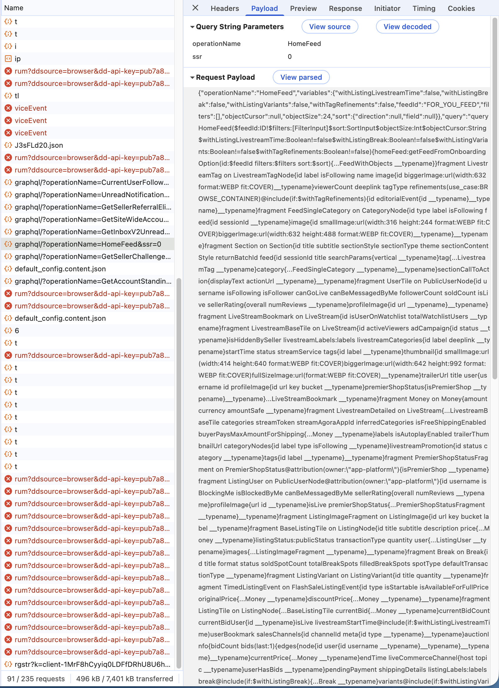
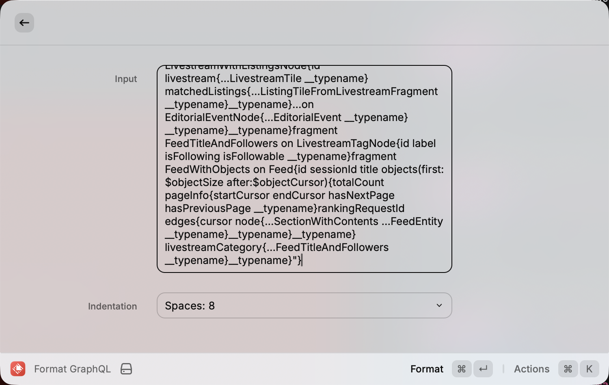
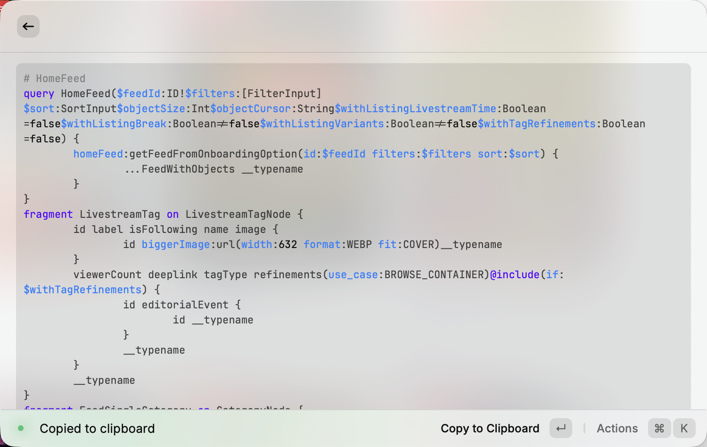

# Format GraphQL

Raycast extension for formatting GraphQL requests copied from Chrome DevTools / ProxyMan / Charles, etc.

## Features

- Parses JSON request bodies (`{"query":"...","variables":{...}}`), formats into separated query and variables, ready to paste into GraphiQL, GraphQL Playground, Apollo Studio, etc.
- Supports batch operations (array of queries)
- Result copied to clipboard directly

## Screenshots

### Copy GraphQL request from Chrome DevTools Network panel



### Input



### Output



## Install to Raycast

```bash
pnpm install
pnpm dev
```

Running `pnpm dev` registers the extension in Raycast immediately. Open Raycast and search for **"Format GraphQL"** to use it.

The extension stays registered even after you stop the dev server. To pick up code changes, run `pnpm dev` again.

Alternatively, you can import the source folder directly in Raycast:

1. Open Raycast, search for **"Import Extension"**
2. Select this project folder
3. Run `pnpm install && pnpm dev`

## Raycast Extension Distribution

Available distribution methods:

| Method                                             | Cost           | Audience | Review             |
| -------------------------------------------------- | -------------- | -------- | ------------------ |
| Using `@raycast/api`                               | Free           | Personal | No                 |
| [Public Store](https://www.raycast.com/store)      | Free           | Everyone | Yes (Raycast team) |
| [Raycast for Teams](https://www.raycast.com/teams) | $12–15/user/mo | Your org | No                 |

`pnpm build` output (`dist/`) is an intermediate artifact for the publishing pipeline — it cannot be installed into Raycast directly.
